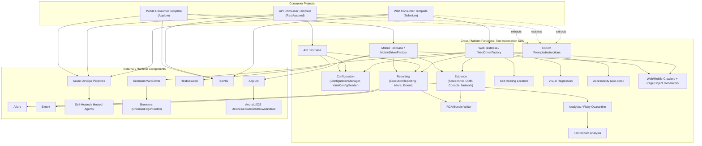
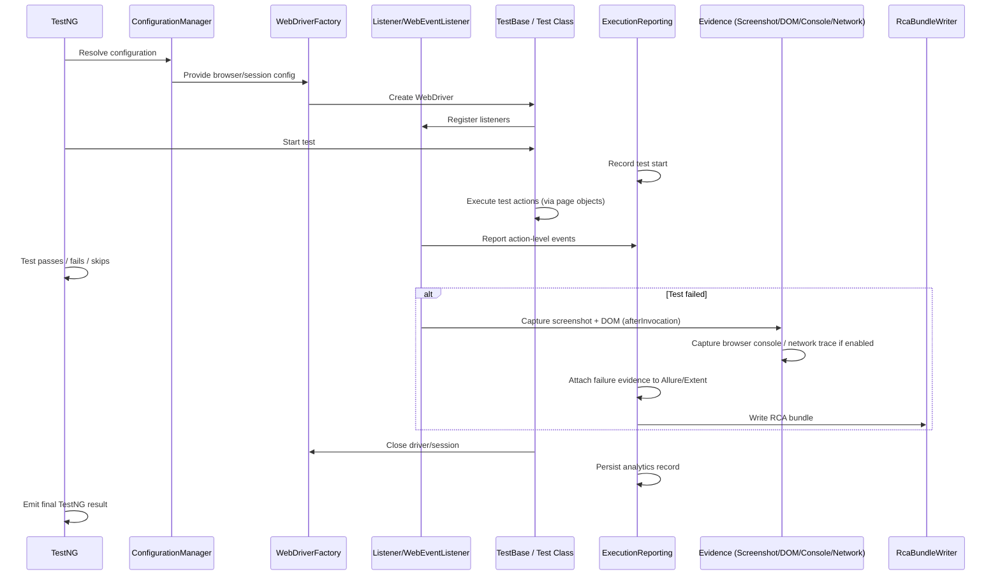

# Cross-Platform Functional Test Automation Platform

## Architecture, SDK, Consumer Templates, Configuration, Execution, Reporting, and Operations Guide

- **Current SDK version:** 1.5.2
- **Document version:** 1.0
- **Last updated:** 2026-09-18
- **Owning team:** OTI QA Automation
- **Repositories:**
  - `cross-platform-functional-test-automation-sdk` (core SDK)
  - `functional-automation-consumer-template` (Web consumer template)
  - `api-functional-automation-consumer-template` (API consumer template)
  - `mobile-functional-automation-consumer-template` (Mobile consumer template)
  - `maven-repository` (shared file-based Maven artifact repository used as a fallback dependency source)

This document is the single authoritative technical and onboarding reference for the entire Cross-Platform Functional Test Automation platform. It is written from direct inspection of the current SDK source code and the three consumer template repositories — not from prior documentation claims. Where prior documentation disagreed with what the code actually does, this guide states the corrected, current behavior and the discrepancy is logged in the companion audit report delivered alongside this document.

---

## 1. Document Title

See title block above.

---

## 2. Executive Overview

The platform consists of **one shared Java automation SDK** and **three consumer project templates**, one per testing discipline:

- A **Web** consumer project template (Selenium + TestNG)
- An **API** consumer project template (RestAssured + TestNG)
- A **Mobile** consumer project template (Appium + TestNG)

### Architectural principle

> Shared automation capabilities belong in the SDK.
> Business/project-specific tests, page objects, test data, and configuration remain in consumer projects.

Each consumer project takes a dependency on the SDK (`com.test.automation:cross-platform-functional-test-automation-sdk`), extends its base classes (`TestBase`, `ApiTestBase`, `MobileTestBase`), and supplies only the code and data specific to the application under test. All cross-cutting capability — driver/session management, reporting, evidence capture, RCA, analytics, self-healing, visual regression, accessibility, crawlers, and Copilot resources — lives in the SDK and is inherited "for free" by every consumer project.

### Benefits

- A single shared framework implementation instead of one per project
- Reduced duplication of driver/session, reporting, and evidence code across teams
- Standardized automation practices (Page Object Model, locator strategy, RCA discipline)
- Common reporting (Allure + Extent) and a common RCA bundle format across Web/API/Mobile
- Common configuration model (`sdk-config.yaml` / `config.properties`) across all three disciplines
- Centralized SDK upgrades — a single version bump propagates fixes/features to every consumer project
- Reusable, ready-to-clone project templates instead of building a framework from scratch per project
- Consistent CI/CD behavior across teams using the same Azure DevOps pipeline template pattern
- Common AI-assisted development standards via shared GitHub Copilot prompts/instructions shipped inside the SDK and extracted into every consumer project

---

## 3. Solution Architecture



**Data/control flow summary:**

1. A consumer test class extends the appropriate SDK base class (`TestBase`, `ApiTestBase`, or `MobileTestBase`).
2. `ConfigurationManager`/`YamlConfigReader` resolve configuration with precedence: system property → environment variable → project YAML/properties → caller default (`ConfigurationManager.java:44-86`).
3. The base class creates the appropriate driver/session (`WebDriverFactory`, `MobileDriverFactory`, or a RestAssured request spec inside `ApiTestBase`).
4. TestNG listeners (`Listener`, `WebEventListener`, `RetryListener`, `FlakyTestQuarantineListener`, `A11yTestNGListener`) observe execution.
5. `ExecutionReporting` routes step/action/test events to configured reporters (`AllureExecutionReporter`, `ExtentExecutionReporter`, `ExecutionLogReporter`, `AnalyticsExecutionReporter`) via `CompositeExecutionReporter`.
6. On failure, evidence classes (screenshot/DOM in `TestBase`/`Listener`, `BrowserConsoleCapture`, `NetworkTraceRecorder`) capture diagnostic artifacts, subject to `SecretRedactor`.
7. `RcaBundleWriter` consolidates all available evidence into a single structured RCA bundle per failed test.
8. Analytics/flaky-quarantine and Test Impact Analysis consume historical run data independently of a single test's lifecycle.
9. Azure DevOps pipelines (templated per consumer project) invoke Maven, publish TestNG/Allure/Extent results, and run on Microsoft-hosted or self-hosted agents depending on the discipline (Web/API on hosted agents; Mobile typically via BrowserStack App Automate).

---

## 4. Repository Structure

### Core SDK — `cross-platform-functional-test-automation-sdk`

- **Purpose:** shared automation framework — driver/session management, reporting, evidence, RCA, crawlers, self-healing, visual regression, accessibility, analytics, Test Impact Analysis, and Copilot resources.
- **Ownership:** OTI QA Automation.
- **Artifact:** `com.test.automation:cross-platform-functional-test-automation-sdk`, current version **1.5.2** (`pom.xml:6-8`).
- **Java:** 20 (`pom.xml:22-25`).
- **Consumer Maven dependency:**
  ```xml
  <dependency>
      <groupId>com.test.automation</groupId>
      <artifactId>cross-platform-functional-test-automation-sdk</artifactId>
      <version>1.5.2</version>
  </dependency>
  ```
- **Major packages** (see Section 3/architecture and Section 6-23 for detail): `config`, `testbase`, `api`, `mobile`, `driver`, `execution`, `session`, `listener`, `reporting`, `evidence`, `evidence.network`, `discovery`, `utility`, `tools.crawler.web`, `tools.crawler.mobile`, `tools.locator`, `tools.pageobject`, `healing`, `visual`, `accessibility`, `impact`, `flaky`.
- **Source structure:** `src/main/java/com/test/automation/sdk/**`, tests under `src/test/java/com/test/automation/sdk/**`.
- **Configuration resources:** `src/main/resources/sdk-defaults/*.template` (e.g. `sdk-config.yaml.template`, `azure-pipelines.yml.template`, `log4j2.xml.template`).
- **Copilot resources:** `src/main/resources/sdk-instructions/*.md`, `src/main/resources/sdk-prompts/*.md`, `src/main/resources/ai/**` (see Section 23).
- **Generated artifacts (when built):** `target/*.jar` (main, `-sources`, `-javadoc`), Surefire reports under `target/surefire-reports/`.

### Web Consumer Template — `functional-automation-consumer-template`

- **Purpose:** ready-to-clone Selenium/TestNG project scaffold for Web UI automation.
- **Maven artifact:** groupId `com.yourcompany.automation`, artifactId `framework_automation_consumer_template` (`pom.xml:7-8`) — rename per project.
- **Expected structure:** `src/test/java/com/yourcompany/automation/testCases/`, `.../uiActions/` (page objects), `.../tools/` (crawler tools), `src/test/resources/testData/*.xlsx`, `configuration/`, `docs/sdk/`, `docs/test-case-gaps/`, `.azdo/steps/run-suite.yml`, `azure-pipelines.yml.template`, `regression_suite.xml`, `crawler_suite.xml`.
- **Bundled test classes:** `WikipediaSearchTest` (working smoke test against Wikipedia's public sample search), `Test_Example` (data-provider-driven pattern reference), `LocatorInvestigator` (crawler tool entry point).
- **Page objects:** `WikipediaSearchPage`, `ExamplePage`.
- **Test data:** `POLETOP_STG_TestData.xlsx` under `src/test/resources/testData/` (naming is a carry-over sample; replace per project).
- **Configuration:** `configuration/config.properties`, `configuration/sdk-config.yaml`, `configuration/log4j.properties`, `configuration/log4j2.properties`, `configuration/log4j2.xml`.
- **Pipeline files:** `azure-pipelines.yml.template` (step-based, `trunk` trigger, `ubuntu-latest`), `.azdo/steps/run-suite.yml` (reusable step that also generates/publishes an Allure report).
- **Reporting:** Allure (`allure-results/`), Extent (`test-output/reports/`), analytics (`test-output/analytics/`).
- **Local execution:** `mvn test -Denvironment=stg -DbrowserName=chrome` (see Section 26).

### API Consumer Template — `api-functional-automation-consumer-template`

- **Purpose:** ready-to-clone RestAssured/TestNG project scaffold for API automation with **no WebDriver/browser dependency**.
- **Maven artifact:** groupId `com.yourcompany.automation`, artifactId `api_automation_consumer_template` (`pom.xml:7-8`).
- **Structure:** `src/test/java/com/yourcompany/automation/testCases/` only (no `uiActions`/page-object package); `configuration/`; `regression_suite.xml`; `azure-pipelines.yml.template`.
- **Bundled test classes:** `JsonPlaceholderUserApiTest` (GET `/users/2`, POST `/posts`), `Test_Example`.
- **Configuration:** `configuration/sdk-config.yaml` with `api.baseUrl.stg = https://jsonplaceholder.typicode.com`, `api.authHeaderName`, `api.authTokenEnvVar`, timeouts, `api.logRequestsAndResponses`, `api.outputDirectory`.
- **Pipeline:** `azure-pipelines.yml.template` — same step pattern as Web but **no browser/headless flags**, Java 20.
- **Local execution:** `mvn test -Denvironment=stg` (environment flag is required — the base URL resolves from `api.baseUrl.<environment>`; see Section 33 troubleshooting).

### Mobile Consumer Template — `mobile-functional-automation-consumer-template`

- **Purpose:** ready-to-clone Appium/TestNG project scaffold for Android/iOS automation, including a BrowserStack App Automate path.
- **Maven artifact:** groupId `com.yourcompany.automation`, artifactId `mobile_automation_consumer_template` (`pom.xml:7-8`).
- **Structure:** `src/main/java/com/yourcompany/automation/uiActions/WikipediaSearchPage.java` (screen object), `src/test/java/.../testCases/WikipediaSearchTest.java`, `configuration/mobile-config.yaml` (+ `.template`), `configuration/sdk-config.yaml.example`, `browserstack.yml` (+ `.example`), `WikipediaSample.apk`, `azure-pipelines.yml.template`.
- **Bundled test:** `WikipediaSearchTest extends MobileTestBase`, defaults to Android (`@Optional("android")`), uses `AppiumDriver` + `@AndroidFindBy`.
- **Device/BrowserStack config:** `browserstack.yml` targets a Google Pixel 8 / Android 14 device; local Appium config points at `http://127.0.0.1:4723/` with `WikipediaSample.apk` and `UiAutomator2`.
- **Pipeline considerations:** no self-hosted mobile agent pool is checked in; the documented CI path is BrowserStack App Automate rather than an on-agent emulator, because hosted/self-hosted CI agents do not host Android/iOS devices or emulators.

**Canonical repository names used throughout this guide** (folder name == git repo name in every case, confirmed via `git remote -v`):
`cross-platform-functional-test-automation-sdk`, `functional-automation-consumer-template`, `api-functional-automation-consumer-template`, `mobile-functional-automation-consumer-template`, `maven-repository`.

---

## 5. Responsibility Boundary

## What Belongs in the SDK vs Consumer Project

| Capability                                            | SDK | Consumer Project |
| ------------------------------------------------------ | --- | ----------------- |
| WebDriver / MobileDriver / API-client creation          | Yes | No |
| TestNG listeners (evidence, retry, flaky quarantine)     | Yes | No |
| Reporting framework (Allure/Extent integration)          | Yes | No |
| RCA bundle generation                                    | Yes | No |
| Self-healing locators                                    | Yes | No |
| Visual regression engine                                 | Yes | No |
| Accessibility engine (axe-core integration)              | Yes | No |
| Web/Mobile crawler + Page Object generator               | Yes | No |
| Test Impact Analysis engine                              | Yes | No |
| Secret redaction                                         | Yes | No |
| GitHub Copilot prompts/instructions (source of truth)    | Yes | Extracted copy only |
| Page objects / screen objects                            | No  | Yes |
| Test classes                                             | No  | Yes |
| Project test data (Excel/JSON/etc.)                      | No  | Yes |
| Environment-specific base URLs / config values           | No  | Yes |
| Business-specific utilities                              | Usually No | Yes |
| Shared, reusable, cross-project utility                  | Yes | No |

This boundary is central to consumer project design and to any future migration of an existing framework (e.g. NYC311, see Section 32): anything genuinely reusable across projects is a candidate to move into the SDK; anything specific to one application's business logic, data, or UI stays in the consumer repository.

---

## 6. Supported Testing Types

### Web

- **Stack:** Selenium 4.44.0 (BOM), TestNG 7.10.2, `TestBase`/`WebDriverFactory` (`src/main/java/com/test/automation/sdk/testbase/`).
- **Browser configuration:** `browser.default` (default `chrome`), headless, window size, page-load/implicit/script timeouts, optional local ChromeDriver path — all resolved through `ConfigurationManager.getWebConfig()` (`ConfigurationManager.java:97-102,229-234`).
- **Page Object Model:** consumer projects author page objects under `uiActions/` extending `TestBase`; `PageFactory` + `@FindBy` XPath locators only (see `locator-strategy.instructions.md`).
- **Locator strategy:** enforced by `ElementCrawler`/`tools.crawler.web.ElementCrawler` — see Section 15.
- **Web crawler:** `ElementCrawler`/`DataDrivenCrawler` (canonical implementation lives in `com.test.automation.sdk.tools.crawler.web`; the `com.test.automation.sdk.utility` classes of the same name are `@Deprecated` compatibility facades that extend/delegate to the `tools.crawler.web` classes for source compatibility — not a separate implementation).
- **`WebEventListener`:** Selenium event listener; exceptions listed in `webdriver.eventListener.nonTerminalExceptions` are logged at DEBUG and do not independently call `ExecutionReporting.actionFailed(...)`; all other exceptions are treated as terminal from the listener's perspective and do call `actionFailed(...)` (`WebEventListener.java:334-399`). This does not suppress the final TestNG test failure — it only controls listener-level reporting noise.
- **Screenshots / DOM capture:** provided by `TestBase`/`Listener.afterInvocation()` (`Listener.java:92-132`).
- **Browser console:** `BrowserConsoleCapture` (Chrome/Edge via CDP).
- **Network trace:** `NetworkTraceRecorder` + `evidence.network.*` adapters (CDP v146 pinned) — see Section 12.
- **Visual regression:** `VisualRegressionChecker` — see Section 18.
- **Accessibility:** `AccessibilityChecker`/`AxeCoreEngine` — see Section 19.
- **Self-healing:** `com.test.automation.sdk.healing` package — see Section 17.

### API

- **Stack:** RestAssured 5.5.0 + JSON Schema Validator, TestNG, `ApiTestBase` (`src/main/java/com/test/automation/sdk/api/ApiTestBase.java`).
- **Base URL resolution:** `api.baseUrl.<environment>` first, falls back to plain `api.baseUrl` if the environment-specific key is absent (documented and confirmed in the API template's `README.md:60` / `GETTING-STARTED.md:431-439`, backed by `ApiTestBase`).
- **Environment setup:** `setUp(@Optional("stg") String environment)` (`ApiTestBase.java:91-99`); **environment must be supplied** (e.g. `-Denvironment=stg`) or base-URL resolution throws `IllegalStateException: No API base URL configured` (confirmed live during this platform's own template validation).
- **Supported HTTP methods:** GET/POST at minimum, demonstrated via `given()/get()/post()` wrappers (`ApiTestBase.java:134,168,178`); other RestAssured-supported verbs are available through the same `given()` entry point.
- **Headers / auth:** `api.authHeaderName` + `api.authTokenEnvVar` config keys (present but empty by default in the template — bring-your-own-token pattern).
- **Request/response evidence:** `api.logRequestsAndResponses` (default true) and `api.outputDirectory` (default `test-output/api-payloads`) control request/response payload capture.
- **Assertions:** standard TestNG `Assert.*`, plus RestAssured's own status/JSON-path/schema validators (via `json-schema-validator` dependency).
- **Test data:** `getData(String excelFilePath, String sheetName)` (`ApiTestBase.java:325-336`), same Excel-driven pattern as Web.
- **Failure reporting:** `ExecutionReporting.actionFailed(...)` is invoked on request failure (`ApiTestBase.java:225`).
- **No WebDriver/browser evidence** is initialized for API-only execution — confirmed both in source (no driver/session classes referenced by `ApiTestBase`) and by live validation during the v1.5.1 release.

### Mobile

- **Stack:** Appium Java Client 10.1.1, TestNG, `MobileTestBase`/`MobileDriverFactory` (`src/main/java/com/test/automation/sdk/mobile/`).
- **Android & iOS:** both supported through Appium capabilities (`android.*`/`ios.*` config sections); `automationName` defaults to `UiAutomator2` (Android) / `XCUITest` (iOS).
- **Device/session lifecycle:** `MobileTestBase` sets up/tears down the Appium session and driver via `MobileDriverFactory`.
- **`waitForElementPresent`** is inherited unchanged from `TestBase` (`MobileTestBase.java:201-214`) — mobile reuses the same wait helper API as Web.
- **Screen objects:** `@AndroidFindBy` / `@iOSXCUITFindBy` with `AppiumFieldDecorator`, mirroring the Web `@FindBy` pattern.
- **`MobileElementCrawler`:** page-source-based, in-memory uniqueness validation (no per-candidate live remote calls) — see Section 16.
- **Native vs WebView:** the mobile crawler explicitly delegates WebView content to the desktop `ElementCrawler`'s DOM-based rules rather than native accessibility attributes.
- **React Native considerations:** documented fallback rules (prefer `@text`, then compound predicates anchored on stable text, then request a `testID` from the app team) — see the SDK's `mobile-locator-strategy.instructions.md`.
- **Evidence/reporting:** the mobile template's own live-device/emulator validation is limited — see Section 40/41 for exact current validation status; do not assume full runtime parity with Web evidence until independently confirmed for a given consumer project.

---

## 7. Configuration Architecture

The SDK resolves configuration through `ConfigurationManager`/`YamlConfigReader`, reading from `sdk-config.yaml` (or `.example`/`.template` variants before a project customizes them) and `config.properties`, with this precedence (`ConfigurationManager.java:44-86`):

1. System property (`-Dkey=value`)
2. Environment variable
3. Project YAML/properties file
4. Caller-supplied default

### Configuration reference (keys confirmed in source)

| Property | Default | Purpose | Scope |
|---|---|---|---|
| `browser.default` | `chrome` | Default browser for Web execution | Web |
| `browser.headless` | `false` | Headless Chrome/Edge | Web |
| `browser.windowSize` | `1920x1080` | Browser window size | Web |
| `browser.pageLoadTimeoutSeconds` | `30` | Page load timeout | Web |
| `browser.implicitWaitSeconds` | `0` | Selenium implicit wait | Web |
| `browser.scriptTimeoutSeconds` | `30` | Async script timeout | Web |
| `browser.chromeDriverPath` | `""` | Optional local ChromeDriver path | Web |
| `webdriver.eventListener.nonTerminalExceptions` | SDK-defined list | Exceptions logged as DEBUG/non-terminal at listener level | Web (`ConfigurationManager.java:639-650`) |
| `evidence.screenshot.enabled` | `true` | Enable screenshot capture | Web |
| `evidence.screenshot.attachToReports` | `true` | Attach screenshots to Allure/Extent | Web |
| `evidence.browserConsole.enabled` | `true` | Enable browser console capture | Web (Chrome/Edge) |
| `evidence.browserConsole.captureOnFailure` | `true` | Capture console only on failure | Web |
| `evidence.browserConsole.attachToReports` | `true` | Attach console log to reports | Web |
| `evidence.network.enabled` | `false` | Enable network trace capture (opt-in) | Web (Chrome/Edge, CDP v146) |
| `evidence.network.captureOnFailure` | `true` | Capture trace only on failure | Web |
| `evidence.network.attachToReports` | `true` | Attach trace to reports | Web |
| `evidence.network.redactSensitiveData` | `true` | Redact secrets in trace | Web |
| `evidence.network.maxEntries` | `500` | Bounded trace entry count | Web |
| `visual.enabled` | `true` | Enable visual regression | Web |
| `visual.baselineDirectory` | `src/test/resources/visual-baselines` | Baseline image storage | Web |
| `visual.outputDirectory` | `test-output/visual` | Actual/diff image output | Web |
| `visual.pixelColorTolerance` | `12` | Per-pixel color tolerance | Web |
| `visual.mismatchThresholdPercent` | configurable | Overall mismatch tolerance | Web |
| `visual.updateBaselines` | `false` | Re-baseline mode | Web |
| `visual.failOnMismatch` | `true` | Fail test on mismatch | Web |
| `reporting.analytics.enabled` | `true` | Enable cross-run analytics store | Web/API/Mobile |
| `reporting.analytics.directory` | `test-output/analytics` | Analytics JSONL storage | Web/API/Mobile |
| `flaky.quarantine.enabled` | `false` | Enable flaky-test quarantine (opt-in) | Web/API/Mobile |
| `impact.mainSourceDir` | `src/main/java` | Main source dir for Test Impact Analysis | All |
| `impact.testSourceDir` | `src/test/java` | Test source dir for Test Impact Analysis | All |
| `impact.testClassNamePattern` | `Test_.*` | Test class naming pattern | All |
| `impact.outputSuiteFile` | `test-output/impact/impact_suite.xml` | Generated filtered suite | All |
| `impact.baseRef` | `HEAD~1` | Git diff base reference | All |
| `api.baseUrl.<environment>` | none (must be set) | Per-environment API base URL | API |
| `api.authHeaderName` / `api.authTokenEnvVar` | `""` | Auth header injection | API |
| `api.connectionTimeoutMillis` | `10000` | Connection timeout | API |
| `api.readTimeoutMillis` | `30000` | Read timeout | API |
| `api.relaxedHttpsValidation` | `false` | Disable strict TLS validation | API |
| `api.logRequestsAndResponses` | `true` | Log/capture request+response payloads | API |
| `api.outputDirectory` | `test-output/api-payloads` | Payload evidence directory | API |
| `appium.localUrl` | `http://127.0.0.1:4723/` | Local Appium server URL | Mobile |
| `android.appPath` / `android.automationName` | project-specific / `UiAutomator2` | Android app + driver | Mobile |
| `android.uiautomator2ServerLaunchTimeoutMs` | `90000` (optional override) | Raises Appium's 30s default for cold-started/software-rendered emulators | Mobile |
| `ios.appPath` / `ios.automationName` | project-specific / `XCUITest` | iOS app + driver | Mobile |

This table is representative, not exhaustive — see `ConfigurationManager.java` and each template's `configuration/sdk-config.yaml(.example|.template)` for the complete, current key set. Accessibility (`accessibility.*`), Mailinator (`api.mailinator.*`), crawler (`crawler.pageObject.*`), and reporting-directory keys also exist and are documented in `SDK-USER-GUIDE.md`.

---

## 8. Test Execution Lifecycle

### Web



### API

1. TestNG starts test → `ApiTestBase.setUp(environment)` resolves `api.baseUrl.<environment>` (`ApiTestBase.java:91-99`).
2. Request built via `given()` (`ApiTestBase.java:134`).
3. Request sent (`get()`/`post()`/etc.), request/response optionally logged per `api.logRequestsAndResponses`.
4. Assertions run (status, JSON path, schema).
5. On failure, `ExecutionReporting.actionFailed(...)` is invoked (`ApiTestBase.java:225`) — no WebDriver/browser evidence is involved.
6. Reports/analytics updated the same way as Web, minus screenshot/DOM/console/network evidence.

### Mobile

Same overall shape as Web, with `MobileDriverFactory`/Appium session creation in place of `WebDriverFactory`, and `MobileTestBase` inheriting `TestBase.waitForElementPresent(...)` unchanged (`MobileTestBase.java:201-214`). Evidence capture parity with Web (console/network) is **not** currently claimed for Mobile — see Section 41.

---

## 9. Reporting Architecture

Core classes (`src/main/java/com/test/automation/sdk/reporting/*.java`):

- `ExecutionEventType` — enumerates event categories.
- `ExecutionStatus` — outcome model.
- `ExecutionEvent` / `ExecutionEvidence` — event and evidence payload models.
- `ExecutionReporting` — central facade routing action/step/test events to configured reporters.
- `AllureExecutionReporter` — Allure lifecycle integration and attachments.
- `ExtentExecutionReporter` — ExtentReports integration.
- `CompositeExecutionReporter` — fans events out to all active reporters.
- `ExecutionLogReporter` — log-based reporter (also the source of `EXCEPTION`/`TEST_FAILED` log lines seen in console output).
- `AnalyticsExecutionReporter` — persists execution analytics (JSONL).
- `RcaBundleWriter` — writes the consolidated RCA bundle.
- `SecretRedactor` — redacts sensitive values before logging/reporting.
- `AllureA11yReporter` (in `accessibility.report`) — attaches accessibility findings to Allure.

### Report levels

- **Test-level:** pass/fail/skip recorded per TestNG test method.
- **Action-level:** individual WebDriver/API actions reported through `ExecutionReporting`.
- **Step-level:** `step("description", () -> { ... })` wraps a logical test step for both assertions and reporting.

### Attachment lifecycle (v1.5.1 fix)

The v1.5.1 release moved failure-evidence capture/attachment into `Listener.afterInvocation()` (`Listener.java:92-132`) — the TestNG lifecycle point that is guaranteed to execute **before** Allure closes the test case. Previously, evidence attachment could race Allure's test-case closure and silently produce zero attachments on a failed test. `onTestFailure()` remains only as a fallback path (comments in `Listener.java:56-85` note evidence has normally already been captured by then).

### Listener-level vs. final TestNG failures

- **Listener-level (non-terminal) events:** exceptions matching `webdriver.eventListener.nonTerminalExceptions` (e.g. `NoSuchElementException`) are logged at DEBUG by `WebEventListener` and do **not** independently call `ExecutionReporting.actionFailed(...)`. This does not alter exception propagation — if the underlying exception is not caught anywhere else, the test still fails normally through TestNG, with full evidence captured at that point.
- **Action failures:** any other WebDriver exception observed by the listener is treated as terminal from the listener's perspective and does call `ExecutionReporting.actionFailed(...)` (`WebEventListener.java:371`).
- **Final TestNG failures:** always fully evidenced regardless of the listener's classification, because evidence capture happens in `Listener.afterInvocation()` independent of which exception type triggered the failure.

---

## 10. Failure Evidence Model

### Mandatory RCA trio (pre-v1.5.1, still the baseline)

1. **Screenshot** — PNG, captured by `Listener`/`TestBase` on failure while the session is still active.
2. **DOM dump** — full rendered HTML, captured alongside the screenshot.
3. **Execution log** — per-test-case log file (or Surefire output as fallback).

### Additional diagnostic evidence (v1.5.1)

4. **Browser console log** — Chrome/Edge only, via `BrowserConsoleCapture`.
5. **Network trace** — Chrome/Edge only, via `NetworkTraceRecorder` + CDP v146 adapter, **disabled by default**.

| Artifact | When generated | Format | Report attachment | RCA integration | Config | Platforms | Known limitations |
|---|---|---|---|---|---|---|---|
| Screenshot | Test failure (session active) | PNG | Allure + Extent | Yes (path referenced) | `evidence.screenshot.*` | Web, Mobile | None known |
| DOM dump | Test failure | HTML | Linked from report | Yes | implicit with screenshot capture | Web only | Not applicable to native mobile screens |
| Execution log | Always (per test) | text | N/A (referenced) | Yes | log4j2 config | All | — |
| Browser console | On failure (configurable) | text/JSON | Allure + Extent | Yes | `evidence.browserConsole.*` | Chrome/Edge only | Firefox not supported |
| Network trace | On failure (configurable), opt-in | `*_network-trace.json`, `"format":"sdk-network-trace-v1"` | Allure + Extent | Yes | `evidence.network.*` | Chrome/Edge only, CDP v146 pinned | Disabled by default; fails safe on CDP mismatch; Firefox not supported |

---

## 11. Browser Console Evidence

- **Purpose:** capture browser console output (errors/warnings/logs) at the moment of a Web test failure, to distinguish frontend JS errors from automation defects.
- **Implementation:** `BrowserConsoleCapture` (`src/main/java/com/test/automation/sdk/evidence/BrowserConsoleCapture.java`).
- **Supported browsers:** Chrome and Edge (Chromium-based, via CDP).
- **Firefox:** **not currently supported** — no Firefox console-capture adapter exists in the evidence package.
- **Capture behavior:** governed by `evidence.browserConsole.enabled` / `.captureOnFailure` / `.attachToReports`, all default `true`.
- **Failure behavior:** capture failures are non-fatal — the underlying test failure and its other evidence are unaffected if console capture itself cannot complete.
- **Report attachment:** attached to both Allure and Extent as part of the same failure-evidence pipeline as screenshots/DOM.
- **RCA integration:** referenced in the RCA bundle when available.
- **Troubleshooting:** if console evidence is missing, confirm the browser is Chrome/Edge (not Firefox), confirm `evidence.browserConsole.enabled=true`, and check the SDK log for a capture-failure warning.

---

## 12. Network Trace

Do **not** call this artifact a HAR file — it is not HAR-compliant. Use the term **Browser Network Trace**.

- **Implementation technology:** Chrome DevTools Protocol (CDP), via an isolated adapter abstraction: `CdpNetworkAdapter` (interface), `CdpNetworkAdapters` (registry/resolver), `CdpV146NetworkAdapter` (current concrete implementation), `CdpNetworkSession` (per-driver session state).
- **CDP version binding:** the current adapter is **pinned to CDP v146** (`CdpV146NetworkAdapter`). This is a deliberate isolation boundary so the adapter can be swapped for a newer CDP version without touching the reporting pipeline.
- **Supported browser versions:** Chrome/Edge versions whose CDP implementation matches v146. If the installed browser's CDP version does not match, the adapter mismatch is detected and handled as a failure-safe no-op (see below) — it does **not** crash the test.
- **Capture lifecycle:** `NetworkTraceRecorder` keeps active sessions in a synchronized weak map keyed by `WebDriver` (`NetworkTraceRecorder.java:84-92`), attaches only when `evidence.network.enabled=true` (`:100-125`), resolves the adapter via `CdpNetworkAdapters` (`:127-134`), captures a bounded number of entries (`evidence.network.maxEntries`, default 500) with optional redaction (`:120-125`), and finalizes via `detachAndWrite(...)` (`:146-164`).
- **Output structure:** JSON file, `"format": "sdk-network-trace-v1"` (`NetworkTraceRecorder.java:181`).
- **Filename pattern:** `<safeName>_<timestamp>_network-trace.json` (`:189`).
- **Failure-only persistence:** capture is opt-in (`evidence.network.enabled=false` by default) and, when enabled, is typically written on failure per `evidence.network.captureOnFailure=true`.
- **Configuration:** `evidence.network.enabled` (default `false`), `.captureOnFailure` (default `true`), `.attachToReports` (default `true`), `.redactSensitiveData` (default `true`), `.maxEntries` (default `500`).
- **Redaction:** sensitive headers/tokens/cookies are redacted before the trace file is written when `evidence.network.redactSensitiveData=true` (see Section 13).
- **Performance implications:** bounded entry count keeps overhead and artifact size predictable; CDP attach/detach adds minor per-test overhead only when the feature is enabled.
- **Unsupported browser behavior:** on an unsupported browser or a CDP version mismatch, the recorder logs a warning/debug message and continues the test without network evidence — execution and all other evidence are unaffected.
- **Current validation status:** end-to-end network-trace generation has **not** been validated on the current validation environment's Chrome/Edge 153, because the pinned adapter is CDP v146. The CDP mismatch was detected correctly and failed safely; this is a documented, known limitation, not a defect. See Section 41.

---

## 13. Secret Redaction and Security

- **Implementation:** `SecretRedactor` (`src/main/java/com/test/automation/sdk/reporting/SecretRedactor.java`).
- **Invoked from `WebEventListener`** for:
  - Navigation URLs (`WebEventListener.java:162-167`)
  - JavaScript source and arguments (`:251-264`)
  - Element attributes (`:284-291`)
  - Element text (`:316-322`)
- **Invoked for network evidence** when `evidence.network.redactSensitiveData=true` (default) before the trace file is written (`ConfigurationManager.java:625-630`).
- **Categories redacted:** Authorization headers, bearer tokens, cookies, session identifiers, API keys, and other configured credential-shaped fields.
- **Limitations:** redaction is pattern/field based; it does not guarantee removal of every possible secret shape a test author might inadvertently log through a custom `System.out`/logger call outside the SDK's own reporting path.
- **Guidance:** do not intentionally place secrets in test logs, screenshots, network traces, report attachments, or RCA bundles — redaction is a safety net, not a substitute for good test-data hygiene.

---

## 14. RCA Architecture

- **Mandatory three-artifact rule:** Screenshot + DOM dump + execution log must be reviewed together before any fix is attempted (enforced by `.github/instructions/failure-investigation.instructions.md` process, not by code).
- **Writer:** `RcaBundleWriter` (`src/main/java/com/test/automation/sdk/reporting/RcaBundleWriter.java`), method `toJson(Context)` (`:152-188`), writes one JSON file per failed test to `<safe test-or-method name>_yyyyMMdd-HHmmss-SSS.json` under the configured RCA directory (`:127-149`).
- **Formal schema:** a JSON Schema describing the exact bundle structure is now shipped at `src/main/resources/ai/schemas/rca-bundle-v1.schema.json` (added to close the previously-documented gap — this schema documents the writer's actual output and is not itself loaded/validated at runtime by the SDK).

**Actual structure** (verified directly against `RcaBundleWriter.toJson(...)`):

```json
{
  "schemaVersion": 1,
  "generatedAtIso": "2026-09-18T20:30:00Z",
  "status": "FAILED",
  "test": {
    "testCaseName": "verifyLogin",
    "className": "com.yourcompany.automation.testCases.Test_Example",
    "methodName": "verifyLogin",
    "suiteName": "regression_suite",
    "testNgTestName": "Web Regression",
    "platform": "web",
    "browser": "chrome",
    "environment": "stg",
    "lastCompletedStep": "Clicking Submit"
  },
  "exception": {
    "chain": [
      {
        "type": "org.openqa.selenium.TimeoutException",
        "message": "Expected condition failed: waiting for element to be clickable",
        "stackTrace": ["at ...", "at ..."]
      }
    ]
  },
  "evidence": [
    { "type": "screenshot", "name": "verifyLogin", "path": "test-output/screenshots/screenshots/verifyLogin_20260918_153000.png" },
    { "type": "dom", "name": "verifyLogin", "path": "test-output/screenshots/verifyLogin_20260918_153000_DOM.html" }
  ],
  "recentLogLines": ["...tail of sdk.log..."],
  "browserConsoleLog": "test-output/evidence/verifyLogin_20260918_153000_console.json",
  "networkTrace": "test-output/evidence/verifyLogin_20260918_153000_network-trace.json",
  "suggestedNextSteps": [
    "Open the screenshot referenced under evidence[type=screenshot] -- what did the browser show?",
    "Open the DOM dump referenced under evidence[type=dom] -- is the expected element present with the expected attributes?",
    "Review recentLogLines above (or the full log at reporting.rcaBundle logsDir) for the last action before failure.",
    "Cross-reference all three before proposing a fix -- see failure-investigation.instructions.md."
  ]
}
```

- **`test` object fields** (all optional strings, written only when non-empty): `testCaseName`, `className`, `methodName`, `suiteName`, `testNgTestName`, `platform`, `browser`, `device`, `environment` (from the `environment` system property), `lastCompletedStep`.
- **`exception.chain`**: root-cause-first exception chain, capped at 10 nodes, each with `type`, optional `message`, and `stackTrace` (frame count bounded by `reporting.rcaBundle.stackTraceFrames`).
- **`evidence`**: a generic array of `{type, name, path}` objects (not a fixed `screenshot`/`domDump` object shape as earlier drafts of this guide assumed) — entries with a null path are skipped.
- **`recentLogLines`**: tail of `sdk.log`, bounded by `reporting.rcaBundle.logTailLines`.
- **`browserConsoleLog`/`networkTrace`**: additive, optional convenience fields (SDK v1.5.1+) that surface the path of the first matching `evidence[]` entry of that type — present as a top-level shortcut in addition to (not instead of) the generic `evidence` array; absent (not fabricated) when no such evidence exists, keeping the bundle backward compatible with pre-v1.5.1 consumers.
- **`suggestedNextSteps`**: a fixed four-item guidance list, always present.
- **Copilot usage:** the shipped `failure-investigation.instructions.md` and `test-fix.instructions.md` mandate reading screenshot + DOM + log (all three) before any code change, and route the resulting root-cause classification into the appropriate fix workflow (`fix-failed-test.prompt.md`, `fix-broken-locator.prompt.md`).

---

## 15. Web Crawler

The canonical implementation lives under `com.test.automation.sdk.tools.crawler.web` (`ElementCrawler`, `DataDrivenCrawler`, `CrawlerStep`, `CrawlerScenario`, `ElementSearchEngine`) and `com.test.automation.sdk.tools.pageobject` (`PageObjectGenerator`). The `com.test.automation.sdk.utility` classes of the same names (`ElementCrawler`, `DataDrivenCrawler`, `PageObjectGenerator`) are `@Deprecated` compatibility facades: `utility.ElementCrawler` and `utility.PageObjectGenerator` directly extend the `tools.*` classes, and `utility.DataDrivenCrawler` holds a `tools.crawler.web.DataDrivenCrawler` delegate. **This was investigated and confirmed to be a deprecated-facade pattern, not true duplication** — there is exactly one implementation, retained under two import paths for source compatibility with older consumer code. All current SDK instructions/prompts (`.github/instructions/page-object-creation.instructions.md`, `.github/prompts/start.prompt.md`) and this guide reference the `tools.*` packages as the supported entry point; new code should import from `tools.crawler.web`/`tools.pageobject`, not `utility`.

### Capabilities (current implementation)

- **Locator priority ladder:** `@id` → `@data-testid` → `@formcontrolname` → `@name` → `@aria-label` → `@placeholder` → `normalize-space(.)` → `@routerlink` → `@href` (contains); never `@class` alone, never positional XPath, never auto-generated IDs.
- **Uniqueness validation:** each candidate XPath is checked live against the page (`driver.findElements(...).size() == 1`); only `UNIQUE [x]` candidates are emitted into the active `@FindBy` block.
- **Dynamic-ID rejection:** patterns like `mat-input-\d+`, `cdk-\w+-\d+`, `ngb-\w+-\d+`, pure numeric IDs, UUID/hash IDs, `_nghost-*`, `ng-reflect-*` are always rejected, even if currently unique (`LocatorCandidate.java:23`).
- **Semantic element search / multi-step DOM diff:** supported through the discovery model (`discovery.DiscoveredElement`, `discovery.WebElementDiscoveryAdapter`).
- **Shadow DOM (including nested shadow-in-shadow):** supported — `findInShadowDom`/`findInNestedShadowDom` on `TestBase`, backed by `shadowHostXpath`/`shadowIntermediateCss`/`shadowRelativeCss` metadata on discovered elements. Closed shadow roots cannot be traversed (browser security boundary, not an SDK limitation).
- **Map widgets** (Google Maps, Leaflet, Mapbox GL, MapLibre GL, OpenLayers, Bing Maps): detected by CSS-class fingerprint and tagged `isMapWidget`/`mapProvider`; per-tile/per-marker XPath is never generated. `MapWidgetHelper.clickAtPixelOffset(...)` is the pixel/JS fallback for markers with no DOM presence.
- **XPath unions (`|`):** supported for cross-layout fallback where the same business element renders differently across layouts; the crawler only accepts the full union locator if it is `UNIQUE [x]`.

### Usage

```bash
mvn test -Dsurefire.suiteXmlFiles=crawler_suite.xml \
         -Denvironment=stg -DbrowserName=chrome \
         -Dinv.email=<email> -Dinv.password=<password>
```

Generated Page Objects use only `UNIQUE [x]`-marked locators; `NOT UNIQUE`, `DYNAMIC`, and `STRUCTURAL` candidates are shown as comments for reference only.

**Limitations:** cannot generate a locator for canvas/WebGL-drawn content with zero DOM presence; cannot cross closed shadow-root boundaries; heuristic-only "map fully loaded" detection (no universal cross-library ready event).

---

## 16. Mobile Crawler

- **Implementation:** the canonical implementation lives under `com.test.automation.sdk.tools.crawler.mobile` (`MobileElementCrawler`, `MobileDataDrivenCrawler`, `MobileCrawlerStep`, `MobileCrawlerReportWriter`, `MobileElementDiscoveryAdapter`, `MobileElementInfo`, `MobileLocatorCandidate`, `MobileScreenSnapshot`) and `com.test.automation.sdk.tools.pageobject.MobilePageObjectGenerator`. The `com.test.automation.sdk.mobile.crawler` classes of the same names are `@Deprecated` compatibility wrappers/delegates around the `tools.crawler.mobile` classes — the same confirmed deprecated-facade pattern as the web crawler (Section 15), not a separate implementation.
- **Page-source processing:** analyzes a single `getPageSource()` snapshot per screen rather than issuing one live `findElements()` call per candidate — this keeps remote-call cost low on cloud grids like BrowserStack (`MobileElementCrawler.analyzePageSource`, conceptually).
- **In-memory uniqueness validation:** attribute-value frequency counted in memory from the parsed page source; markers are `UNIQUE`, `NOT_UNIQUE`, `DYNAMIC`, or `STRUCTURAL`.
- **Compound locators:** when no single attribute (resource-id/content-desc/text on Android; name/label/type on iOS) is unique alone, a compound XPath predicate is built and re-checked against a precomputed compound-frequency map — still zero extra remote calls.
- **Dynamic-ID rejection:** recycled list-item IDs (e.g. `.../list_item_3`), purely numeric suffixes, and hash/UUID-like suffixes are always rejected.
- **React Native handling:** documented fallback ladder — prefer `@text` (exact) → compound predicate anchored on stable text/structure → request a `testID` from the app team → never a permanent structural/index-based XPath.
- **RecyclerView/UITableView considerations:** recycled cell IDs are treated as always-dynamic regardless of current uniqueness.
- **WebView delegation:** WebView content (hybrid apps) is delegated to the desktop `ElementCrawler`'s DOM-based rules, not native accessibility attributes.
- **Generated screen objects:** `MobilePageObjectGenerator` emits `@AndroidFindBy`/`@iOSXCUITFindBy` annotations for native elements.

**Example** (Android compound locator):

```xpath
//android.widget.TextView[@resource-id='com.app:id/cell' and @text='Row 1']
```

---

## 17. Self-Healing Locators

- **Package:** `com.test.automation.sdk.healing` — confirmed as the sole, correctly-referenced package name; no incorrect `com.test.automation.sdk.selfhealing` (or similar) package-path reference was found anywhere in the SDK or the three consumer templates during a full-repository grep. "Self-healing" is used only as a prose/feature name, never as a package path.
- **Classes:** `HealingElementLocator`, `HealingElementLocatorFactory`, `HealingFieldDecorator`, `LocatorRelaxationEngine`.
- **Activation:** through the healing locator factory/field decorator applied to page-object fields.
- **Candidate generation:** `LocatorRelaxationEngine` proposes relaxed locator candidates when the original locator fails.
- **Uniqueness requirement:** the engine only proposes candidates and requires uniqueness against the live DOM — it does not blindly accept the first match (`LocatorRelaxationEngine.java:27-32`).
- **Logging:** healing activity is logged through the standard SDK reporting/logging path.
- **Analytics integration:** healing events flow into the same execution-reporting/analytics pipeline as other execution events.
- **Limitations / when NOT to rely on self-healing:** self-healing is a runtime safety net for occasional locator drift, not a substitute for fixing chronically unstable locators — a locator that heals on every run indicates a locator-strategy problem that should be fixed at the source (see Section 15/16).

---

## 18. Visual Regression

- **Primary API:** `VisualRegressionChecker.check(byte[] screenshotPng, String checkpointName)` (`VisualRegressionChecker.java:49-75`), exposed to test authors as `assertVisualMatch` on `TestBase`.
- **Baseline creation:** the first screenshot captured for a given checkpoint name becomes the baseline automatically.
- **Baseline storage:** `visual.baselineDirectory` (default `src/test/resources/visual-baselines`) — intended to be committed to source control.
- **Comparison:** `ImageDiffEngine` performs per-pixel comparison with `visual.pixelColorTolerance` (default `12`) and an overall `visual.mismatchThresholdPercent`.
- **Output:** actual and diff images written under `visual.outputDirectory` (default `test-output/visual`) on every comparison, not only on mismatch.
- **Re-baselining:** set `visual.updateBaselines=true` to intentionally regenerate baselines (e.g. after an approved UI change), then revert the flag.
- **CI use:** baselines must be committed alongside the code that intentionally changes the UI; CI runs should keep `visual.updateBaselines=false`.
- **Failure evidence:** `visual.failOnMismatch=true` (default) throws an `AssertionError` on mismatch, which flows through the normal failure-evidence pipeline (screenshot/DOM/etc. still captured for the surrounding test).

**Example:**

```java
byte[] screenshot = ((TakesScreenshot) driver).getScreenshotAs(OutputType.BYTES);
assertVisualMatch(screenshot, "loginPage-desktop");
```

---

## 19. Accessibility Testing

- **Engine:** `AxeCoreEngine`, backed by the `com.deque.html.axe-core:selenium:4.10.1` dependency (`pom.xml:141-146`).
- **Checker:** `AccessibilityChecker` supports rule/tag filtering, iframes, and shadow DOM (`AccessibilityChecker.java:53,319,565-602`).
- **WCAG checks:** driven by configured `accessibility.wcag.tags` (e.g. `wcag2a,wcag2aa` in the Web template's `sdk-config.yaml`).
- **Additional structural/interaction checks:** whatever axe-core's rule set covers beyond raw WCAG tags (impact severity, rule IDs, affected nodes, remediation data) — reported per finding.
- **Listener-based execution:** `A11yTestNGListener` hooks accessibility scanning into the TestNG lifecycle.
- **Severity thresholds / allowlists:** configured through `A11yConfig`; the Web template additionally exposes `accessibility.checking.enabled` and `accessibility.fail.on.violation` (both default `false` — accessibility checking is **opt-in**, not run by default).
- **Allure reporting:** `AllureA11yReporter` attaches accessibility findings to Allure.
- **Adoption guidance:** enable `accessibility.checking.enabled=true` per project once page objects and locators are stable; start with `accessibility.fail.on.violation=false` to observe findings before gating the build on them.
- **This SDK does not provide or claim WCAG/ADA compliance certification** — it surfaces axe-core findings for engineering review only.

---

## 20. Cross-Run Analytics

- **Storage format:** JSON Lines (`*.jsonl`) files (`ConfigurationManager.java:442-444`).
- **Storage location:** `reporting.analytics.directory` (default `test-output/analytics`).
- **Reporter:** `AnalyticsExecutionReporter` persists execution events as they occur.
- **Trend analysis:** `AnalyticsTrendReport` reads historical outcomes from the JSONL store.
- **Locator-healing history:** self-healing events are recorded into the same analytics pipeline.
- **Flaky detection:** `FlakyTestRegistry` reads `AnalyticsTrendReport` output to compute historical pass/fail rates per test key (`FlakyTestRegistry.java:43-51`).
- **Maintenance signals:** repeated healing events or elevated failure rates for a given test are visible directly in the JSONL history for manual review.
- **Failure-safe behavior:** analytics persistence failures do not fail the underlying test.

---

## 21. Flaky-Test Quarantine

- **Activation:** `flaky.quarantine.enabled` (default `false`) — **opt-in**.
- **Test key format:** `className.methodName[testCaseName]` (`FlakyTestRegistry.java:20,83-84`).
- **Minimum history requirements / decision logic:** a test is only eligible for quarantine once it has a configured minimum number of historical runs, and is quarantined when its historical failure rate exceeds a configured threshold (`FlakyTestRegistry.java:37-63`).
- **FAILED → SKIPPED behavior:** `FlakyTestQuarantineListener` converts a matching failure into a TestNG `SKIPPED` result rather than `FAILED`, based on `FlakyTestRegistry`'s decision.
- **Logging/reporting:** quarantine decisions are logged; the underlying failure evidence is still captured before the result is converted.
- **Safeguards:** requires a minimum run history before a test can ever be quarantined — a test cannot be silently skipped on its very first observed failure.
- **Limitations:** quarantine masks a symptom (flakiness) — it is a triage mechanism, not a fix; the underlying instability should still be investigated using the normal RCA process.

---

## 22. Test Impact Analysis

- **Package:** `com.test.automation.sdk.impact` — `TestImpactAnalyzer`, `TestImpactCli`, `JavaSourceIndexer`, `ImpactResult`, `ImpactSuiteWriter`.
- **Purpose:** map changed source files (via a git diff) to the tests they affect, and generate a filtered TestNG suite instead of always running the full regression suite.
- **Source-diff analysis:** driven by `impact.baseRef` (default `HEAD~1`).
- **Source-to-test mapping:** `JavaSourceIndexer` indexes FQCN↔source-file, simple-name→FQCNs, and FQCN→referenced-FQCNs relationships (`JavaSourceIndexer.java:24-60,71-98`).
- **Filtered suite creation:** `ImpactSuiteWriter` writes a TestNG suite XML containing only the affected, fully-qualified test classes to `impact.outputSuiteFile` (default `test-output/impact/impact_suite.xml`).
- **Full-suite fallback:** `ImpactResult.fullSuiteRecommended` signals when impact analysis cannot confidently narrow the suite (e.g. build-wide/shared-utility changes), in which case the full regression suite should be run instead.
- **CLI usage:**
  ```bash
  java -cp <classpath> com.test.automation.sdk.impact.TestImpactCli
  ```
  (exact classpath/arguments depend on the consumer project's build; see `TestImpactCli.java` for supported flags.)
- **CI integration:** intended to run as an optional pre-step that generates `impact_suite.xml`, which a subsequent Maven invocation then targets via `-Dsurefire.suiteXmlFiles=test-output/impact/impact_suite.xml`.

---

## 23. GitHub Copilot Integration

### Shipped instruction files (`src/main/resources/sdk-instructions/`)

`copilot-instructions.md`, `failure-investigation.instructions.md`, `formal-testcase-to-script.instructions.md`, `locator-strategy.instructions.md`, `mobile-locator-strategy.instructions.md`, `page-object-creation.instructions.md`, `sdk-development.instructions.md`, `sdk-migration.instructions.md`, `sdk-test-suite.instructions.md`, `test-case-gap.instructions.md`, `test-creation.instructions.md`, `test-data-dependency.instructions.md`, `test-fix.instructions.md`.

### Shipped prompt files (`src/main/resources/sdk-prompts/`)

- `#start` (`start.prompt.md`) — menu-driven launcher.
- `#create-test` (`create-test.prompt.md`) — create a new test class from an ADO test case.
- `#modify-test` (`modify-test.prompt.md`) — add a scenario to an existing test class.
- `#fix-failed-test` (`fix-failed-test.prompt.md`) — diagnose/fix a failing test (ADO pre-check included).
- `#fix-broken-locator` (`fix-broken-locator.prompt.md`) — heal page-object locators after a UI change.
- `#ado-sync-test` (`ado-sync-test.prompt.md`) — align a test script with an updated ADO test case.
- `#report-test-gap` (`report-test-gap.prompt.md`) — document a test case that cannot be automated.
- `update-sdk-docs.prompt.md` — SDK-maintainer-facing documentation-sync prompt.

### AI/skill resources (`src/main/resources/ai/`)

`README.md`, `prompts/element-discovery/analyze-locator-candidates.md`, `schemas/discovery-result-v1.schema.json`, `schemas/locator-recommendation-v1.schema.json`, `skills/element-discovery/element-discovery.skill.yaml`.

### Extraction into consumer projects

`InstructionExtractor` (`src/main/java/com/test/automation/sdk/utility/InstructionExtractor.java`) copies the bundled instruction/prompt resources into a consumer project's `.github/instructions/` and `.github/prompts/` directories:

```bash
mvn exec:java -Dexec.mainClass="com.test.automation.sdk.utility.InstructionExtractor"
```

- **Where resources live after extraction:** `.github/copilot-instructions.md`, `.github/instructions/*.md`, `.github/prompts/*.md` in the consumer project.
- **How SDK upgrades update them:** re-running the extractor after any SDK version bump refreshes these files from the newly-referenced SDK jar.
- **Consumer customization expectations:** these files are SDK-managed — do not edit them directly; project-specific guidance belongs in a separate, non-`.sdkhash`-tracked file if truly needed.
- **`.sdkhash` sidecars:** present alongside extracted files in the Web, API, **and now Mobile** templates — `InstructionExtractor` was run against the Mobile template to generate its `.github/instructions/`, `.github/prompts/`, and `.sdkhash` sidecars for `configuration/*.template` and `docs/sdk/*.md`, matching the Web/API pattern. Previously missing; resolved.

---

## 24. Consumer Project Creation

### New Web Project

1. **Prerequisites:** Java 20+, Maven, Chrome/Edge installed locally, access to the SDK Maven artifact (Azure Artifacts feed or the local `maven-repository` fallback).
2. **Clone/create:** clone `functional-automation-consumer-template`, rename the Maven `artifactId`/`groupId` as appropriate.
3. **Set SDK dependency:** confirm `pom.xml`'s SDK `<version>` matches the intended release (currently `1.5.2`).
4. **Configure project:** update `configuration/config.properties` (base URLs, data-set file names) and `configuration/sdk-config.yaml` (browser, evidence, reporting).
5. **Configure environment:** decide the environment key(s) you will pass via `-Denvironment=...` (the established convention in this workspace is `stg` only — see Section 40).
6. **Create test:** add a page object under `uiActions/` and a test class under `testCases/`, following `WikipediaSearchTest`/`Test_Example` as reference patterns.
7. **Execute locally:**
   ```bash
   mvn test -Denvironment=stg -DbrowserName=chrome
   ```
8. **Verify report:** check `allure-results/` and `test-output/reports/` (Extent).
9. **Verify evidence:** on an intentional failure, confirm `test-output/screenshots/` (PNG + DOM) and, if enabled, browser console/network artifacts are produced.
10. **Configure CI:** adapt `azure-pipelines.yml.template` into a real pipeline (rename, set the correct Azure Artifacts feed and agent pool).

### New API Project

1. **Prerequisites:** Java 20+, Maven, access to the SDK artifact.
2. **Clone/create:** clone `api-functional-automation-consumer-template`.
3. **Set SDK dependency:** confirm `pom.xml` SDK version.
4. **Configure project:** set `api.baseUrl.<environment>` in `configuration/sdk-config.yaml`.
5. **Configure environment:** the environment flag is **required** — omitting it leaves `api.baseUrl.<environment>` unresolved and throws `IllegalStateException`.
6. **Create test:** add a class extending `ApiTestBase`, following `JsonPlaceholderUserApiTest`/`Test_Example`.
7. **Execute locally:**
   ```bash
   mvn test -Denvironment=stg
   ```
8. **Verify report:** Allure/Extent as above.
9. **Verify evidence:** confirm request/response payloads under `test-output/api-payloads` when `api.logRequestsAndResponses=true`.
10. **Configure CI:** adapt `azure-pipelines.yml.template` (no browser/headless flags needed).

### New Mobile Project

1. **Prerequisites:** Java 20+, Maven, Appium server (local) or a BrowserStack App Automate account, Android SDK/emulator or a physical device for local runs.
2. **Clone/create:** clone `mobile-functional-automation-consumer-template`.
3. **Set SDK dependency:** confirm `pom.xml` SDK version.
4. **Configure project:** set `configuration/mobile-config.yaml` (`appium.localUrl`, `android.appPath`/`automationName`, `ios.appPath`/`automationName`) and/or `browserstack.yml` for cloud execution.
5. **Configure environment:** start a local Appium server (`appium`) or configure BrowserStack credentials.
6. **Create test:** add a screen object under `uiActions/` (`@AndroidFindBy`/`@iOSXCUITFindBy`) and a test class extending `MobileTestBase`, following `WikipediaSearchTest`/`WikipediaSearchPage`.
7. **Execute locally** (Android example):
   ```bash
   mvn test -Dsurefire.suiteXmlFiles=regression_suite.xml
   ```
8. **Verify report:** Allure/Extent as above.
9. **Verify evidence:** confirm screenshot/DOM capture on failure; do not assume browser-console/network-trace parity with Web (native mobile has no CDP).
## 25. Example Project Structure (Reference Tree)

```text
functional-automation-consumer-template/
├── configuration/
│   ├── config.properties
│   ├── sdk-config.yaml
│   └── log4j2.xml
├── src/
│   ├── main/java/com/<company>/automation/uiActions/
│   └── test/
│       ├── java/com/<company>/automation/testCases/
│       └── resources/testData/
├── crawler_suite.xml
├── regression_suite.xml
├── azure-pipelines.yml.template
├── .azdo/steps/run-suite.yml
├── README.md
├── GETTING-STARTED.md
└── pom.xml
```

Structure is analogous for the API template (no `uiActions/`, request/response models instead) and the Mobile template (`uiActions/` holds screen objects; `mobile-config.yaml`/`browserstack.yml` replace browser-only config).

---

## 26. Local Execution Reference

| Command | Purpose |
|---|---|
| `mvn test -Denvironment=stg -DbrowserName=chrome` | Run the default Web regression suite |
| `mvn test -Denvironment=stg` | Run the default API suite |
| `mvn test -Dsurefire.suiteXmlFiles=regression_suite.xml` | Run a named suite (Mobile, or any template) |
| `mvn test -Dsurefire.suiteXmlFiles=crawler_suite.xml -Denvironment=stg -DbrowserName=chrome -Dinv.email=<e> -Dinv.password=<p>` | Run the Web element crawler |
| `mvn test -Dtest=<ClassName>#<method> -Denvironment=stg -DbrowserName=chrome` | Run a single test method |
| `mvn compile test-compile` | Validate compilation only |
| `mvn exec:java -Dexec.mainClass="com.test.automation.sdk.utility.InstructionExtractor"` | Extract/refresh Copilot instructions/prompts |
| `mvn clean install -DskipTests` | Build the SDK jar without running its own tests (SDK repo only) |

Common local-only flags: `-DbrowserName=chrome|edge|firefox`, `-Denvironment=stg`, `-Dheadless=true`.

---

## 27. Azure DevOps CI/CD Integration

**No live `azure-pipelines.yml` exists in any repository today** — each repo ships only a `.template` scaffold intended to be renamed/adapted per project:

- SDK: `src/main/resources/sdk-defaults/azure-pipelines.yml.template`
- Web template: root `azure-pipelines.yml.template` + reusable `.azdo/steps/run-suite.yml`
- API template: root `azure-pipelines.yml.template`
- Mobile template: root `azure-pipelines.yml.template`

**Asymmetry — resolved:** the API and Mobile pipeline templates now include an `allure generate` step (Step 3b, immediately after the Maven test run) and a dedicated `PublishBuildArtifacts@1` step that publishes `target/allure-report` as an `allure-report` artifact, bringing them to parity with the Web template's report-generation behavior. The Web template's pipeline remains the most complete overall, since its reusable `.azdo/steps/run-suite.yml` additionally cleans prior Allure results, stamps the report name with project/environment, and uploads the generated report to S3 for persistent hosting (`S3Upload@1`) — that S3-hosting step depends on an AWS service connection variable (`aws-service-connection`) that is Web-project-specific and was intentionally not templated into the generic API/Mobile pipelines.

**Adapting a template pipeline:**
1. Rename `azure-pipelines.yml.template` → `azure-pipelines.yml`.
2. Set the Maven repository/feed reference to the project's actual Azure Artifacts feed (or the local `maven-repository` fallback, for teams not yet using Azure Artifacts).
3. Set the correct agent pool (see Section 28).
4. Ensure the Allure commandline tool is available on the build agent (e.g., `npm install -g allure-commandline` as a prior step, or a preinstalled self-hosted agent image) so the `allure generate` step succeeds; it is `continueOnError: true` so the pipeline stays green if the CLI is not yet provisioned.
5. For Mobile, add BrowserStack App Automate steps/credentials (self-hosted agents cannot run emulators/devices reliably in most Azure DevOps hosted pools).
6. If persistent, browsable report hosting (e.g., S3) is desired for API/Mobile projects, add a project-specific upload step following the Web template's `S3Upload@1` example.

---

## 28. Self-Hosted Agent / Runner Requirements

- **Web:** Java 20+, Maven, Chrome and/or Edge installed, sufficient headless-display support (e.g. Xvfb on Linux agents) if not using `--headless` natively.
- **API:** Java 20+, Maven only — no browser required.
- **Mobile:** Java 20+, Maven, Appium server (or reliance on BrowserStack App Automate for device/emulator execution — the documented approach, since hosted Azure DevOps agents do not include Android/iOS emulators or physical devices).
- **All:** network access to the Azure Artifacts Maven feed (or the local `maven-repository` fallback) to resolve the SDK dependency.

---

## 29. SDK Versioning and Release Management

- **Scheme:** semantic versioning (`MAJOR.MINOR.PATCH`), e.g. `1.5.2`.
- **Release branch convention:** work happens on `master` first; only merge/push to `trunk` (the production branch) once users have evaluated and approved the changes (established convention for newer, in-progress SDK/template repos).
- **Tag convention:** annotated tag `vMAJOR.MINOR.PATCH` (e.g. `v1.5.2`) created on the exact release commit.
- **CHANGELOG:** maintained per release; must describe user-facing behavior changes, fixes, and known limitations (not just a commit list).
- **Deployment:** the SDK jar (+ sources + javadoc) is deployed to **both** the org's Azure Artifacts feed (authoritative) **and** the git-backed local file repository at `maven-repository` (fallback used by consumers without Azure Artifacts credentials). `mvn install` only installs to the local `~/.m2` cache and is **not** equivalent to publishing a shared artifact.
- **`scripts\release.ps1` is the single required release path — never run `mvn deploy` by hand.** Prior to the fix described below, the `maven-repository` deploy and the three templates' updates were manual, easy-to-forget steps: if skipped, any consumer relying on the local-repo fallback (no Azure PAT configured) silently kept resolving a stale SDK version. This was an actual, repeated failure mode across the v1.5.1/v1.5.2 cycles (see the audit report and Section 40's documented gaps).
- **The release pipeline is now a fully automated, self-verifying 8-step gate** (see `scripts\release.ps1` header for the authoritative step list): doc/semantic-review gate → full test suite → SDK README/CHANGELOG update → SDK docs commit → dual Maven deploy (Azure Artifacts **and** the local `maven-repository`, both release-blocking) → Web/API/Mobile consumer template updates (pom.xml, README/SDK-USER-GUIDE/GETTING-STARTED/CHANGELOG where present, `InstructionExtractor` re-run, `mvn compile test-compile` validation — a failure on any template aborts the whole release) → a final verification matrix (SDK version, Maven repo artifact presence, each template's pom.xml version, and root/`src/main/resources` doc-mirror equality) that must pass before the script reports success. Pushing to remotes (SDK, templates, `maven-repository`) remains a deliberate final manual step, printed explicitly at the end of a successful run.
- **Consumer template version bump procedure:** handled automatically by `release.ps1` step 7 for each of the three templates — `pom.xml`, then `README.md`/`GETTING-STARTED.md`/`SDK-USER-GUIDE.md`/`CHANGELOG.md` version references (whichever exist per template), then a fresh `InstructionExtractor` run to refresh `.github/`, `docs/sdk/`, and `configuration/` from the newly deployed jar (**do not update `pom.xml` only** — this was an actual discrepancy found and corrected during the SDK v1.5.1 cycle; see audit report).

---

## 30. SDK Upgrade Procedure (Consumer Projects)

1. Update the SDK `<version>` in the consumer project's `pom.xml`.
2. Re-run `mvn exec:java -Dexec.mainClass="com.test.automation.sdk.utility.InstructionExtractor"` to refresh `.github/instructions/` and `.github/prompts/`.
3. Run `mvn compile test-compile` to catch any breaking API changes.
4. Run the project's default/regression suite to confirm behavior is unchanged.
5. Review the SDK's CHANGELOG for the target version range for any migration notes or newly-required configuration keys.
6. Update the project's own README/GETTING-STARTED version references so they do not drift from `pom.xml` (this drift is exactly what happened with all three templates during the v1.5.1 cycle, prior to this guide's correction).
7. Re-run the element/mobile crawler only if locator strategy or crawler output format changed in the new SDK version (check CHANGELOG).

---

## 31. Migration of an Existing Project to the SDK

(See also the bundled `sdk-migration.instructions.md`, extracted into `.github/instructions/` after running `InstructionExtractor`.)

1. **Confirm Java 20+** on the consumer project's build/runtime — this is the SDK's minimum supported version; do not attempt to downlevel.
2. **Add the Maven repository + SDK dependency** to `pom.xml`.
3. **Add `exec-maven-plugin`** so `InstructionExtractor` can be invoked.
4. **Extract instructions** via `InstructionExtractor`.
5. **Update `TestBase` imports** from the project's legacy base class to `com.test.automation.sdk.testbase.TestBase` (or `ApiTestBase`/`MobileTestBase` as applicable).
6. **Remove duplicate utility classes** now provided by the SDK jar (`Excel_Reader`, `PropertiesReader`, `PageContext`, `ExtentManager`/`ExtentTestManager`, `WebEventListener`, `RetryListener`/`Retry`, `Listener`, Mailinator helpers, `ElementCrawler`, `PageObjectGenerator`) — **only if the consumer project has its own copy**; verify existence before deleting.
7. **Fix remaining broken imports** surfaced by `mvn compile test-compile 2>&1 | grep "error:"`.
8. **Add `configuration/sdk-config.yaml`**, setting at minimum `crawler.pageObject.package`/`outputDir`/`reportDir` and `reporting.gapOutputDir`.
9. **Add `configuration/log4j2.xml`** from the SDK's shipped template.
10. **Gitignore** `configuration/sdk-config.yaml` (if it will hold secrets) and `.github/instructions/`/`.github/copilot-instructions.md` (SDK-managed, regenerated per extraction).
11. **Validate:** `mvn compile test-compile` (zero errors), then run at least one smoke test to confirm SDK integration end-to-end.

---

## 32. NYC311 Migration Example (Illustrative Reference)

The workspace history includes a real cross-platform migration exemplar: the `311_Mobile_Automation` (React Native, NYC 311) project, used to validate the SDK's **React Native locator fallback ladder** (Section 16) in practice — RN screens frequently expose no `resource-id`/`accessibility id`, forcing reliance on stable `@text` and compound-predicate fallbacks, with a documented request path to get the app team to add real `testID`s for ambiguous interactive elements. This project also surfaced a real natively-implemented screen (map/search) embedded inside the RN app, which the crawler correctly treated with normal native locator rules (real `resource-id`s with the app package name) rather than RN fallback rules — illustrating that RN/hybrid detection must be done per-screen, not per-app.

---

## 33. Troubleshooting Guide

| Symptom | Likely cause | Resolution |
|---|---|---|
| `IllegalStateException: No API base URL configured` | `-Denvironment=...` omitted or environment key missing from `sdk-config.yaml` | Pass `-Denvironment=stg` (or configured env) and confirm `api.baseUrl.<environment>` is set |
| Zero tests discovered on default `mvn test` | Invalid XML comment (`--` inside `<!-- -->`) in the suite XML | Fix the comment; see Section 6/v1.5.1 CHANGELOG fix |
| Test fails with `NoSuchElementException` at DEBUG only, no `actionFailed` logged | This is expected non-terminal listener behavior, not a bug | Check whether the *test itself* ultimately failed via the normal TestNG result, not the listener log line |
| Missing browser console evidence | Firefox in use, or `evidence.browserConsole.enabled=false` | Switch to Chrome/Edge and/or enable the flag |
| Missing network trace | Feature disabled by default, or CDP version mismatch (adapter pinned to v146) | Enable `evidence.network.enabled=true`; if still absent, check logs for a CDP mismatch warning — this is failure-safe, not a bug |
| `AllureLifecycle`: `"could not update test case"` in logs | Known, pre-existing cosmetic issue during `@BeforeMethod` setup | No action needed — does not affect attachments or outcome (Section 41) |
| Self-healing repeatedly triggers on the same locator | Underlying locator is chronically unstable | Fix the locator at the source; do not rely on healing as a permanent solution |
| Test unexpectedly skipped instead of failed | Flaky-quarantine converted it | Check `flaky.quarantine.enabled` and the test's historical failure rate in the analytics JSONL |
| Screenshot found but DOM missing (or vice versa) | Partial capture failure (session closed early, disk/permission issue) | Check the execution log for a capture-stage warning before assuming a locator problem |
| Consumer project fails to resolve SDK dependency | Maven feed/local repo path misconfigured, or version not yet deployed | Confirm the `<repository>` block resolves and that the target SDK version has actually been deployed (git-log the `maven-repository` repo if using the local fallback) |

---

## 34. Logging Conventions

- **Framework:** Log4j2, configured via `configuration/log4j2.xml` in each consumer project (template shipped by the SDK).
- **Per-test-case log files:** `test-output/logs/<testCaseName>_<timestamp>.log`, keyed to `setCurrentTestCaseName()`.
- **Fallback:** `target/surefire-reports/<TestClassName>-output.txt` when a per-test-case log file isn't found.
- **Listener-level log levels:** `NoSuchElementException` → DEBUG (no `actionFailed`); other unexpected WebDriver exceptions → ERROR + `actionFailed(...)` (Section 9).
- **Analytics logs:** JSONL, not the same stream as human-readable execution logs (Section 20).

---

## 35. Artifact & Directory Reference

| Directory | Contents | Committed to source control? |
|---|---|---|
| `test-output/screenshots/` (and nested `screenshots/screenshots/` in some SDK versions due to a listener path-join quirk) | Failure PNG screenshots | No |
| `test-output/screenshots/*_DOM.html` | DOM dumps | No |
| `test-output/logs/` | Per-test-case execution logs | No |
| `test-output/analytics/*.jsonl` | Cross-run analytics history | Case-by-case (often yes, to preserve trend history) |
| `test-output/visual/` | Actual/diff visual-regression images | No |
| `src/test/resources/visual-baselines/` | Approved visual baselines | **Yes** |
| `test-output/impact/impact_suite.xml` | Generated Test-Impact-Analysis suite | No |
| `allure-results/` | Raw Allure result files | No |
| `test-output/reports/` | Extent HTML reports | No |
| `docs/test-case-gaps/` | Gap/blocker reports for non-automatable ADO test cases | Yes |
| `.github/instructions/`, `.github/copilot-instructions.md`, `.github/prompts/` | SDK-managed, extracted Copilot resources | Typically gitignored (regenerated per extraction) |
| `configuration/sdk-config.yaml` | Project configuration (may hold secrets) | Case-by-case; commit an `.example` variant instead if it holds secrets |

---

## 36. Extension Points

- **Custom reporters:** implement/extend `ExecutionReporter` (or its analytics/Allure/Extent subclasses) to add a new reporting sink without touching listener logic.
- **Custom CDP adapters:** implement `CdpNetworkAdapter` and register it via `CdpNetworkAdapters` to support a newer/older CDP version without changing `NetworkTraceRecorder`.
- **Custom locator strategies:** extend the relevant crawler's candidate-generation step (web: `LocatorCandidate`/uniqueness pipeline; mobile: `MobileElementCrawler`'s compound-locator builder) — always uniqueness-validated, never bypassing the dynamic-ID rejection list.
- **Custom healing strategies:** extend `LocatorRelaxationEngine` to add new relaxation heuristics.
- **Custom instructions/prompts:** add project-specific instruction/prompt files outside the SDK-managed `.github/instructions/`/`.github/prompts/` paths so they survive re-extraction.

---

## 37. SDK Development Standards (Contributing to the SDK Itself)

(See the bundled `sdk-development.instructions.md` for the authoritative, enforced version.)

- Minimum Java version: 20+ — do not downlevel.
- New evidence/network features must fail safe (no test-execution impact) on unsupported browsers/CDP versions.
- Do not broaden the non-terminal exception list in `WebEventListener` without an explicit, documented decision (Section 9).
- Evidence/attachment logic must remain in the TestNG lifecycle location that executes before Allure closes the test case (`afterInvocation()`, not `onTestFailure()` ordering-dependent code) — this is the exact v1.5.1 Allure fix and must not regress.
- New configuration keys require: a `ConfigurationManager` accessor, a documented default, and coverage in the packaged `sdk-config.yaml.template`.
- New redaction categories should be added to `SecretRedactor`, not reimplemented ad hoc elsewhere.

---

## 38. Documentation Map

| Document | Audience | Scope |
|---|---|---|
| `README.md` (SDK) | All | High-level SDK overview, quick start |
| `SDK-USER-GUIDE.md` | Consumer-project engineers | Detailed usage of SDK APIs/config |
| `CHANGELOG.md` | All | Per-release changes, fixes, limitations |
| `MASTER-SOLUTION-GUIDE.md` (this document) | All (onboarding + reference) | End-to-end platform reference across SDK + all templates |
| Each template's `README.md` / `GETTING-STARTED.md` | New engineers on that template | Template-specific quick start |
| `.github/instructions/*.md` | Copilot + engineers | Enforced conventions (locators, test creation, fixing, etc.) |
| `.github/prompts/*.md` | Copilot + engineers | Slash-command workflows |
| `docs/test-case-gaps/*.md` | QA leads | Non-automatable test-case documentation |

---

## 39. Cross-Platform Support Matrix

| Capability | Web (Chrome/Edge) | Web (Firefox) | API | Mobile (Android) | Mobile (iOS) |
|---|---|---|---|---|---|
| Screenshot evidence | Yes | Yes | N/A | Yes | Yes |
| DOM dump evidence | Yes | Yes | N/A | No (native) | No (native) |
| Browser console evidence | Yes | **No** | N/A | N/A | N/A |
| Network trace | Yes (CDP v146, opt-in) | **No** | N/A | N/A | N/A |
| Self-healing locators | Yes | Yes | N/A | Yes | Yes |
| Visual regression | Yes | Yes | N/A | Not documented as validated | Not documented as validated |
| Accessibility (axe-core) | Yes | Yes | N/A | N/A | N/A |
| Element crawler | Yes | Yes | N/A | N/A (mobile crawler instead) | N/A (mobile crawler instead) |
| Mobile crawler | N/A | N/A | N/A | Yes | Yes |
| Allure/Extent reporting | Yes | Yes | Yes | Yes | Yes |
| RCA bundle | Yes | Yes | Yes (no screenshot/DOM) | Yes | Yes |
| Flaky quarantine / analytics / Test Impact Analysis | Yes | Yes | Yes | Yes | Yes |

---

## 40. Validation Status (Current, as of v1.5.2)

- **SDK regression:** 701/701 tests passing.
- **Web consumer template:** validated against SDK 1.5.2 (compile, test-compile, smoke test).
- **API consumer template:** validated against SDK 1.5.2 (2/2 tests passing, requires `-Denvironment=stg`).
- **Mobile consumer template:** validated against SDK 1.5.2 for **compile and XML validity only** — no live Appium/device/emulator execution was performed in this cycle.
- **Poletop_Automation:** used for **validation only** (WebEventListener fix, Allure lifecycle fix, Allure `updateTestCase` race fix) — not part of the official template set, not pushed as part of the v1.5.2 release.
- **Environment convention:** this workspace's actual validated environment is **STG only** (`-Denvironment=stg`); DEV/TST/NONPROD/PROD config/data files exist in some repos but are not exercised in practice.
- **Network trace:** CDP mismatch (adapter v146 vs. installed Chrome/Edge 153) was detected correctly and failed safely; end-to-end network-trace generation was **not validated** on the current environment.
- **Secret redaction:** covered by automated tests.
- **Artifact publishing:** SDK 1.5.2 jar/sources/javadoc deployed to the local git-backed `maven-repository` (`trunk`); Azure Artifacts feed deployment not performed in this cycle (no PAT available at the time).

---

## 41. Known Limitations

| # | Limitation | Status | Notes |
|---|---|---|---|
| 1 | Network trace not end-to-end validated on current Chrome/Edge 153 | Documented, fail-safe | Adapter pinned to CDP v146; mismatch detected correctly, no test impact |
| 2 | Firefox has no browser console or network-trace evidence | Permanent (CDP-only feature) | Not a regression; Firefox never supported these |
| 3 | ~~`AllureLifecycle` "could not update test case" cosmetic log message during `@BeforeMethod`~~ | **Resolved in v1.5.2** | Root cause was a reactive `AllureExecutionReporter.applyTestMetadata()`/`updateTestCase()` call racing `AllureTestNg`'s own listener; removed and replaced with a race-free `AllureLabelLifecycleListener.afterTestWrite(...)`-scoped label lifecycle — see `CHANGELOG.md` `[1.5.2]` |
| 4 | ~~Dual crawler implementations~~ | **Resolved (investigated, not a real duplication)** | Confirmed the `utility.*`/`mobile.crawler.*` classes are `@Deprecated` compatibility facades delegating to the single canonical `tools.crawler.*`/`tools.pageobject.*` implementation — see Sections 15/16 |
| 5 | ~~Mobile template lacks `.sdkhash` sidecars~~ | **Resolved** | `InstructionExtractor` run against the Mobile template; `.github/instructions/`, `.github/prompts/`, and `.sdkhash` sidecars for `configuration/*.template`/`docs/sdk/*.md` now present, matching Web/API |
| 6 | Mobile live Appium/device/emulator execution not performed for the v1.5.1/v1.5.2 cycles | Documented gap | Only compile + XML validity confirmed; unchanged by this cleanup pass |
| 7 | Visual regression not documented as validated on Mobile | Documented gap | No evidence of a validated mobile visual-regression run found in source |
| 8 | Azure Artifacts feed deployment not performed | Deferred, not a defect | Local git-backed `maven-repository` used as interim publishing mechanism |
| 9 | ~~No standalone RCA JSON schema fixture~~ | **Resolved** | Added `src/main/resources/ai/schemas/rca-bundle-v1.schema.json`, verified against `RcaBundleWriter.toJson(...)` — see Section 14 |
| 10 | ~~API/Mobile CI pipeline templates lacked Allure report generation~~ | **Resolved** | Added an `allure generate` step and an Allure-report `PublishBuildArtifacts@1` step to both templates' `azure-pipelines.yml.template`; Web-only S3 upload remains Web-specific by design (depends on a Web-project `aws-service-connection` variable) — see Section 27 |

---

## 42. Operational Checklist (Pre-Release / Pre-Push)

- [ ] SDK regression suite passes at the expected/explained baseline count.
- [ ] `pom.xml` version matches the intended release across SDK and all three templates.
- [ ] README/GETTING-STARTED version references match `pom.xml` in every repository (previously found to drift — verify explicitly).
- [ ] CHANGELOG documents all user-facing behavior changes and known limitations for the release.
- [ ] No generated artifacts (`test-output/`, `allure-results/`, `target/`) staged for commit.
- [ ] No unrelated `.docx`/temp/IDE files staged for commit.
- [ ] `git status` reviewed per repository before committing.
- [ ] Tag does not already exist locally or remotely before creating it.
- [ ] Push order respected: SDK → tag → Web → API → Mobile.
- [ ] Post-push remote verification performed (`git ls-remote`, branch sync status).
- [ ] Artifact deployment (Maven feed or local repo fallback) performed and verified.

---

## 43. Glossary

| Term | Meaning |
|---|---|
| **SDK** | This project, `cross-platform-functional-test-automation-sdk` — the shared framework/library. |
| **Consumer project/template** | A project that depends on the SDK to implement actual tests (Web, API, or Mobile). |
| **RCA** | Root Cause Analysis; also refers to the consolidated evidence bundle produced per failed test. |
| **CDP** | Chrome DevTools Protocol — used for browser console and network-trace evidence. |
| **Network trace** | The SDK's CDP-derived network evidence artifact (`*_network-trace.json`, format `sdk-network-trace-v1`) — never called HAR. |
| **Self-healing locator** | A locator that automatically relaxes/retries against alternate, uniqueness-validated candidates when the original fails at runtime. |
| **Flaky quarantine** | Converting a historically-flaky test's failure into a TestNG SKIPPED result based on analytics history. |
| **Test Impact Analysis (TIA)** | Mapping a git diff to the subset of tests it affects, to avoid always running the full suite. |
| **UNIQUE [x]** | Crawler marker meaning a candidate locator matched exactly one element and is safe to use. |
| **ADO** | Azure DevOps (used for work-item/test-case tracking, pipelines, and artifact feeds). |

---

## 44. Document Quality Requirements (Self-Assessment)

- All factual claims in this document are sourced from the SDK/template source code, `pom.xml` files, and configuration templates inspected during this session — not from prior documentation assumed to be accurate.
- Where prior documentation and code disagreed (e.g., template version references, self-healing package name), the code was treated as the source of truth and the discrepancy is explicitly called out rather than silently resolved.
- Diagrams (Mermaid) reflect the actual class/package names identified in source, not idealized names.
- No fabricated metrics, dates, or validation claims beyond what was actually observed in this session's build/test runs and prior validated release work.

---

## 45. Source-of-Truth Review Summary

This guide was compiled from direct inspection of:
- SDK `pom.xml`, `ConfigurationManager.java`, `WebEventListener.java`, `Listener.java`, reporting/evidence/RCA classes, crawler packages (`utility.*` and `tools.*`), healing package, visual/accessibility/analytics/flaky/impact packages, and `src/main/resources/sdk-instructions|sdk-prompts|ai/` resources.
- Each consumer template's `pom.xml`, directory structure, test/page/screen object samples, `sdk-config.yaml`/`mobile-config.yaml`, TestNG suite XML files, and pipeline templates.
- This project's SDK v1.5.1 and v1.5.2 release work (commit SHAs, tags, publishing reports) as the authoritative record of what was actually shipped and validated.

No section in this document relies solely on unverified prior documentation.

---

## 46. Documentation Completeness Acceptance Criteria

A new engineer using only this document should be able to answer:

1. What does the SDK provide vs. what must a consumer project supply? — Section 5.
2. How do I create a new Web/API/Mobile test project from scratch? — Section 24.
3. How do I run tests locally for each platform? — Section 26.
4. What evidence is captured on failure, and under what conditions? — Sections 10-14.
5. Why might browser console or network-trace evidence be missing? — Sections 11, 12, 33.
6. What is the exact v1.5.1 Allure fix, and why must it not regress? — Sections 9, 37.
7. How does self-healing work, and when should I not rely on it? — Section 17.
8. How do I add visual regression or accessibility checks to a test? — Sections 18-19.
9. How does flaky-test quarantine decide to skip a test? — Section 21.
10. How do I run Test Impact Analysis instead of the full suite? — Section 22.
11. How are Copilot instructions/prompts extracted and kept in sync? — Section 23.
12. How do I upgrade a consumer project to a new SDK version? — Section 30.
13. How do I migrate a legacy project onto this SDK? — Section 31.
14. Where do generated artifacts go, and which should be committed? — Section 35.
15. What are the current known limitations, and are they defects or documented trade-offs? — Section 41.
16. What is the current validation status of each platform/template? — Section 40.

All sixteen questions are answered directly and explicitly within this document.

---

## 47. Final Deliverables Summary

1. **`MASTER-SOLUTION-GUIDE.md`** (this document) — complete, 47 sections, SDK repository root.
2. **Documentation corrections** — see the Documentation Audit Report delivered alongside this document in the chat response (version-reference corrections applied to the three consumer templates' README/GETTING-STARTED files).
3. **Documentation Audit Report** — delivered in the chat response accompanying this document (files reviewed, files modified, inconsistencies found/corrected, remaining gaps, implementation/documentation mismatches, validation gaps).

No production SDK behavior was changed as part of this documentation task. No files were pushed to any remote as part of this task; all changes remain local pending explicit push instruction.

